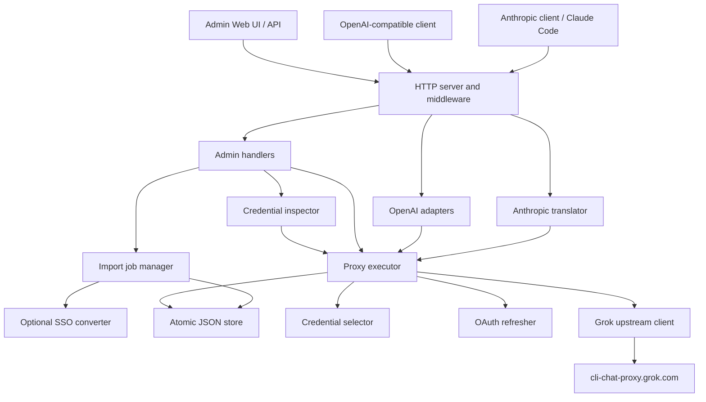

# Design

## Overview

`grokbuild-proxy` is a single-process compatibility gateway between local
Anthropic/OpenAI clients and the Grok Build Responses backend.

The service owns four responsibilities:

1. Translate request and response protocols.
2. Manage operator-owned OAuth credentials.
3. Select and fail over between credentials safely.
4. Expose local administration and operational signals.

It intentionally uses the Go standard library and local JSON storage to remain
easy to audit and operate.

## Goals

- Run as one self-contained binary.
- Default to loopback-only access.
- Support Claude Code's Messages, tools, streaming, structured output, and
  thinking behavior.
- Support OpenAI Responses and Chat Completions clients.
- Preserve protocol ordering and surface failures rather than fabricating
  success.
- Persist rotated OAuth credentials and credential health across restarts.
- Keep prompts, tokens, keys, and encrypted reasoning out of logs.
- Remain usable without PostgreSQL, Redis, Kubernetes, or a frontend build
  toolchain.

## Non-goals

- Multi-tenant SaaS operation.
- Generic routing across arbitrary AI providers.
- Bypassing upstream plans, quotas, policy, or authorization.
- Reimplementing every Anthropic/OpenAI endpoint.
- Providing portable Anthropic thinking signatures.
- Server-side conversation storage.

## Architecture



## Package boundaries

| Package | Responsibility |
|---|---|
| `cmd/grokbuild-proxy` | Configuration, dependency wiring, process lifecycle |
| `internal/httpserver` | Routing, client auth, limits, probes, metrics, request logs |
| `internal/anthropic` | Messages request/response/SSE translation |
| `internal/openai` | Responses sanitization and Chat Completions adaptation |
| `internal/proxy` | Credential selection, token acquisition, retries, failover |
| `internal/lb` | Priority round-robin, sticky sessions, cooldown state |
| `internal/auth` | OAuth discovery, device flow, import, refresh |
| `internal/importer` | Bounded asynchronous multi-format credential imports |
| `internal/inspection` | Scheduled/manual validation, quarantine, delayed cleanup |
| `internal/outbound` | Global/per-credential proxy resolution and transport caching |
| `internal/sso` | Protected optional SSO converter client |
| `internal/storage` | Credentials, client keys, bootstrap metadata, atomic writes |
| `internal/upstream` | Grok request headers, models, billing, Responses transport |
| `internal/admin` | Authenticated management API |
| `internal/adminui` | Embedded zero-build Admin SPA |

## Request flows

### Anthropic Messages

```text
POST /v1/messages
  -> validate client key and request limits
  -> resolve Claude alias to Grok model
  -> translate Messages input to Responses input
  -> select sticky credential
  -> refresh token when needed
  -> POST upstream /v1/responses
  -> translate JSON or SSE back to Anthropic Messages
```

Important mappings:

- `tool_use` to `function_call`
- `tool_result` to `function_call_output`
- `output_config.format` to `text.format`
- versioned Anthropic `web_search_*` to Grok `web_search`
- thinking effort to Grok reasoning effort
- Grok reasoning summary to Anthropic thinking text
- Grok `encrypted_content` to a proxy-scoped opaque signature

### OpenAI Responses

Responses requests are sanitized for known upstream differences, assigned a
stable prompt-cache key, and otherwise preserved. Native encrypted reasoning
items remain in order for stateless continuation.

### Chat Completions

Chat messages and client function tools are converted to Responses items.
Responses JSON/SSE is converted back into Chat Completions choices and chunks.

## Thinking bridge

Grok and Anthropic use different reasoning controls and encrypted state.

The compatibility bridge follows the CPA pattern:

1. Request `reasoning.encrypted_content` when Anthropic thinking is enabled.
2. Convert Grok reasoning summaries into Anthropic `thinking` blocks.
3. Carry Grok encrypted reasoning as the block's opaque `signature`.
4. Emit `signature_delta` only when encrypted content is non-empty.
5. On the next tool turn, restore the signature as a Grok reasoning input item
   before the corresponding function call and result.

The signature is meaningful only to this proxy/upstream route. It must not be
presented as a portable signature issued by Anthropic.

## Streaming state machines

Streaming translators maintain per-output-item state:

- Monotonic Anthropic content-block indexes
- Independent parallel function-call argument streams
- Thinking summary and signature lifecycle
- Completed/incomplete/failed terminal state
- Usage aggregation
- Duplicate suppression for terminal envelopes

Once response bytes are written, credential failover is prohibited because
replaying a partial stream would duplicate or reorder output.

## Credential lifecycle

Credentials contain an access token, refresh token, expiry, account identity,
priority, enabled state, and persisted health.

The request path:

1. Select a usable credential using sticky priority round-robin.
2. Reuse a non-expired access token.
3. If needed, refresh through a per-credential `singleflight`.
4. Persist both the new access token and rotated refresh token atomically.
5. Send the upstream request.
6. Mark success or apply failure cooldown.

HTTP 402 and 429 can fail over before a response body is sent. Credential health
survives process restarts.

OAuth refresh is currently request-driven; there is no background pre-refresh
scheduler.

Credential identity is independent of source filenames or JSON object keys.
OIDC issuer, client, user/team identity is preferred; normalized email and
token fingerprints are compatibility fallbacks. Batch imports validate first,
then commit successful credentials with one locked atomic store write.

The OAuth issuer is a fixed trust boundary, not imported routing data. Only
`https://auth.x.ai` is accepted for persisted credentials and runtime refresh;
discovery, device-code, and token endpoints are revalidated before secrets are
sent. Test-only endpoint overrides require an explicit unsafe test flag.

The inspector probes each credential through that credential's resolved route.
A 401 is refreshed and re-probed; quarantine requires both repeated 401 evidence
and a terminal refresh failure. A successful refresh followed by another 401 is
retained for later inspection rather than deleted. A 429 only enters cooldown;
network, proxy, 402/403/407, and 5xx failures are retained. Automatic physical
deletion is disabled by default and, when enabled, requires an expired retention
period, an unchanged token fingerprint, and a fresh terminal-auth confirmation.

## Outbound routing

Routing precedence is credential `direct`/URL, runtime Admin settings, YAML,
environment proxy variables, then direct. Invalid configured proxies fail
closed instead of silently using a direct connection. Admin responses expose
only the route mode/source and redacted URL. Token refresh, model/billing calls,
generation, and inspection resolve through the same credential route.

## Credential imports

The Admin import API accepts repeated files or raw text and recognizes Grok
auth JSON, CPA xAI JSON, and SSO text. Parsing may produce per-item warnings or
failures; all successful normalized credentials are committed as one storage
batch. Raw SSO exists only in process memory until the optional sidecar returns
normalized credentials.

## Storage

Runtime state is stored under `data_dir`:

```text
credentials.json
clients.json
meta.json
settings.json
```

Storage properties:

- Process-lifetime file lock
- Atomic temporary-file write and rename
- Directory `fsync`
- Validated JSON backup before replacement
- Backup recovery for corrupt primary files
- `0600` secret files and `0700` newly created directories
- Dangerous data-directory rejection
- Atomic field patches to avoid stale full-record token overwrites

## Security model

The trusted boundary is one operator on a loopback or otherwise trusted
network.

Threats and controls:

| Threat | Control |
|---|---|
| Accidental public exposure | Loopback default and explicit public-listen opt-in |
| Client quota abuse | Hashed, revocable client API keys |
| Admin API abuse | Separate admin key |
| Token leakage | Local secret files, masking, no prompt/token logs |
| Concurrent refresh rotation | Per-credential singleflight and atomic persistence |
| Duplicate process corruption | Process-lifetime data-directory lock |
| Partial/corrupt writes | Atomic writes, sync, backup validation and recovery |
| Oversized requests | Configurable body and concurrency limits |
| Malicious endpoint override | Strict HTTPS/xAI configuration validation |

Encrypted reasoning and thinking signatures are treated as prompt-equivalent
secrets.

## Observability

- JSON request logs with local request IDs
- Upstream request ID kept separately
- Prometheus-compatible counters and duration metrics
- `/healthz` liveness
- `/readyz` storage/credential readiness
- Admin credential-pool summary

Prompts, request bodies, OAuth tokens, and generated keys are not logged.

## Design decisions

| Decision | Rationale | Trade-off |
|---|---|---|
| Single Go binary | Simple deployment and auditability | Less modular than separate services |
| Embedded Admin UI | No Node build/runtime dependency | UI remains intentionally small |
| Local JSON storage | Suitable for single-operator use | Not appropriate for clustered writes |
| Responses as canonical upstream | Preserves current Grok capabilities | Requires protocol state machines |
| Loopback-first | Protects credentials and quota by default | Containers require explicit internal bind |
| Sticky credential sessions | Improves cache and encrypted-state continuity | Failover can lose account-bound reasoning state |
| Explicit compatibility matrix | Avoids claiming full API emulation | Unsupported features remain visible |

## Known limitations

- Anthropic token counting is not implemented.
- Rich Anthropic server-tool result and citation blocks are reduced to the
  supported common subset.
- Only Anthropic server-side web search has a dedicated hosted-tool mapping.
- Some Anthropic reasoning controls require documented approximation.
- Account-bound encrypted reasoning may not survive credential failover.
- OAuth refresh has no background scheduler.
- The upstream CLI protocol can change independently of this repository.

## Change history

### 2026-07-10 — v0.1.0 release design

- Added protocol-correct streaming state machines.
- Added CPA-style thinking and encrypted reasoning replay.
- Added structured output and hosted web-search mapping.
- Added persistent credential health, storage locking, and backup recovery.
- Added Admin UI, observability, release automation, and live probes.
